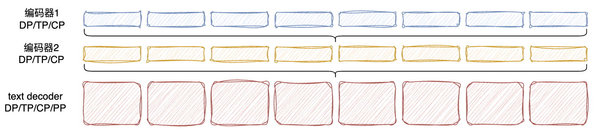
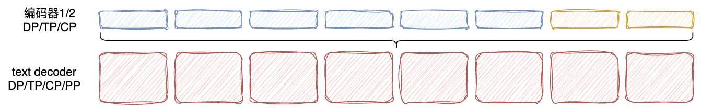
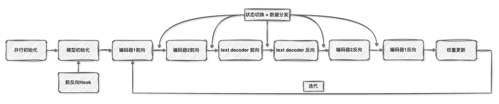

hetero-parallel
===============

Last updated: 04/07/2026. Author: Shangda-Yang

1. 技术背景与挑战
--------------------

随着AI技术的发展，多模态模型（如图文、音视频模型）已成为研究热点，其规模也在急剧增长。这些模型通常包含多个具有不同计算特性的模块，例如Vision Transformer，Audio Encoder，Text Decoder等。各模块由于模型结构、数据的差异性，在相同并行策略下效率存在差异，单一并行策略难以满足大规模多模态模型的训练需求。

现有技术面临的挑战
:::::::::::::::::::

1. **传统并行技术的局限性**
   - 统一并行策略组合（DP/TP/PP/SP/CP）无法充分利用不同模态模块的计算特性
2. **显存与计算资源平衡**
   - 计算、显存负载分配不均衡，导致资源利用率低下
   - 局部资源瓶颈影响整体训练性能

2. 概述
-------------

Hetero Parallel（异构并行）是 MindSpeed-MM 中用于多模态模型的一种异构并行技术，它允许模型中的不同模块（如图像编码器、音频编码器、文本解码器）使用不同的并行配置（例如DP/TP/CP/SP/PP），从而更灵活地利用计算资源并优化性能。

注意：目前暂未识别到编码器使用独立PP并行的场景，编码器部分暂不支持PP。

当前部署方案为全共卡异构并行：

未来计划支持局部共卡异构并行。

3. 核心设计
-------------

- **模块级并行配置**：为多模态模型中的不同组件（image_encoder、audio_encoder、text_decoder）设置独立的并行策略
- **动态并行状态切换**：在不同模块的前/反向传播过程中自动切换并行状态
- **数据高效传递**：实现不同并行组之间的数据分发与收集机制
- **灵活的流水线并行**：支持异构流水线并行（文本解码器部分独立编排流水，灵活复用现有大模型流水线调度策略），优化多模态模型的训练流程

4. 关键实现文件
------------------

4.1 核心实现： ``hetero_parallel.py``
::::::::::::::::::::::::::::::::::::::::

路径： ``MindSpeed-MM/mindspeed_mm/utils/hetero_parallel.py``

主要功能：

- 定义了支持的异构并行模块列表
- 实现了模型前/反向传播前后的并行状态切换钩子
- 提供了数据在不同并行组之间传递的核心函数
- 管理不同模块的并行状态

4.2 流水线并行补丁： ``hetero_pipeline_patches.py``
::::::::::::::::::::::::::::::::::::::::::::::::::::::

路径： ``MindSpeed-MM/mindspeed_mm/patchs/hetero_pipeline_patches.py``

主要功能：

- 扩展了标准流水线并行机制以支持异构并行
- 实现了多模块之间的流水线执行逻辑
- 管理不同模块之间的数据流转

4.3 VLM模型集成： ``vlm_model.py``
::::::::::::::::::::::::::::::::::::

路径： ``MindSpeed-MM/mindspeed_mm/models/vlm_model.py``

主要功能：

- 在多模态模型中集成hetero parallel功能
- 根据配置初始化不同模块的并行设置
- 管理模块间的并行状态切换

5. 核心功能实现
-----------------

特性工作原理如下图：

1. **并行初始化**：解析模型配置，为每个模块创建独立的并行状态快照

2. **模型初始化**：创建多模态模型，注册模块前向钩子
3. **前向传播**：
   - 模块前向钩子触发，切换到对应模块的并行状态
   - 收集/分割数据以适应目标模块的并行配置
   - 执行模块前向计算
   - 模块后向钩子触发，恢复原始并行状态
4. **流水线执行**：在异构流水线模式下，多个模块按顺序执行，实现高效的流水线并行

主要模块实现方式在本章节中的子章节展开。

5.1 并行状态管理
:::::::::::::::::::

.. code-block:: python

    # 支持的异构并行模块列表
    _HeteroParallelModules = ['image_encoder', 'audio_encoder', 'text_decoder']

    # 并行状态字典，用于存储各模块的并行状态快照
    _ParallelStatesDict = {}

    # 初始化各模块的并行状态并保存快照
    def initial_modules_mpu(reuse_module, args):
        # 实现模块并行状态的初始化和快照保存

    # 切换并行状态
    def change_parallel_state(module):
        # 在不同模块（module）之间切换并行状态

5.2 模块前向钩子
:::::::::::::::::::

为不同模块注册前向传播前后的钩子函数，实现并行状态的自动切换和数据处理：

.. code-block:: python

    # 图像编码器前向传播前钩子
    def image_encoder_forward_pre_hook(module, input):
        # 实现并行状态切换和数据收集

    # 图像编码器前向传播后钩子
    def image_encoder_forward_hook(module, input, output):
        # 实现数据收集和并行状态切换

    # 音频编码器前向传播前钩子
    def audio_encoder_forward_pre_hook(module, input):
        # 实现并行状态切换和数据收集

    # 音频编码器前向传播后钩子
    def audio_encoder_forward_hook(module, input, output):
        # 实现数据收集和并行状态切换

5.3 数据并行组操作
::::::::::::::::::::

.. code-block:: python

    def all_gather_dp_group(tensor, pad_token_id=None, cat_dim=0, pad_dim=1, remove_padding=False):
        # 在数据并行组内收集张量
        # 支持对不同长度的序列进行填充和去填充
        
    def split_tensor_dp_group(tensor, split_dim=0, pad_dim=1, chunk_seq_lens=None):
        # 在数据并行组内分割张量
        # 支持按指定长度分割

5.4 异构流水线并行
:::::::::::::::::::::

.. code-block:: python

    def hetero_pipeline(pipeline_meta_list, forward_backward_func_list, *, ...):
        # 实现多模块的异构流水线并行执行
        # 管理不同模块之间的数据流转和并行状态切换

6. 配置与使用
---------------

6.1 权重切分
:::::::::::::::::

xP（encoders） + TP2（text decoder） + PP2（text decoder） 切分
^^^^^^^^^^^^^^^^^^^^^^^^^^^^^^^^^^^^^^^^^^^^^^^^^^^^^^^^^^^^^^^^^^^^^^^^^^^^^^^^^^^^^^^^

.. code:: bash

    # qwen2.5omni 7b(hf2mm)
    mm-convert  Qwen2_5_OmniConverter hf_to_mm \
      --cfg.mm_dir "ckpt/mm_path/Qwen2.5-Omni-7B" \
      --cfg.hf_config.hf_dir "ckpt/hf_path/Qwen2.5-Omni-7B" \
      --cfg.parallel_config.llm_pp_layers [[14,14]] \
      --cfg.parallel_config.vit_pp_layers [[32]] \
      --cfg.parallel_config.audio_pp_layers [[32]] \
      --cfg.parallel_config.tp_size 2 \
      --cfg.parallel_config.vit_tp_size 1 \
      --cfg.parallel_config.audio_tp_size 1
    
    # qwen2.5vl 7b(hf2mm)
    mm-convert  Qwen2_5_VLConverter hf_to_mm \
      --cfg.mm_dir "ckpt/mm_path/Qwen2.5-VL-7B-Instruct" \
      --cfg.hf_config.hf_dir "ckpt/hf_path/Qwen2.5-VL-7B-Instruct" \
      --cfg.parallel_config.llm_pp_layers [[12,16]] \
      --cfg.parallel_config.vit_pp_layers [[32]] \
      --cfg.parallel_config.tp_size 2 \
      --cfg.parallel_config.vit_tp_size 1

对应的权重逆转换
^^^^^^^^^^^^^^^^^^^^^^^^^^^^^^^^^^^^^^^^^^^^

.. code:: bash

    # qwen2.5omni 7b(mm2hf)
    mm-convert  Qwen2_5_OmniConverter mm_to_hf \
      --cfg.save_hf_dir "ckpt/mm_to_hf/Qwen2.5-Omni-7B" \
      --cfg.mm_dir "ckpt/mm_path/Qwen2.5-Omni-7B" \
      --cfg.hf_config.hf_dir "ckpt/hf_path/Qwen2.5-Omni-7B" \
      --cfg.parallel_config.llm_pp_layers [14,14] \
      --cfg.parallel_config.vit_pp_layers [32] \
      --cfg.parallel_config.audio_pp_layers [32] \
      --cfg.parallel_config.tp_size 2 \
      --cfg.parallel_config.vit_tp_size 1 \
      --cfg.parallel_config.audio_tp_size 1

    # qwen2.5vl 7b(mm2hf)
    mm-convert  Qwen2_5_VLConverter mm_to_hf \
      --cfg.save_hf_dir "ckpt/mm_to_hf/Qwen2.5-VL-7B-Instruct" \
      --cfg.mm_dir "ckpt/mm_path/Qwen2.5-VL-7B-Instruct" \
      --cfg.hf_config.hf_dir "ckpt/hf_path/Qwen2.5-VL-7B-Instruct" \
      --cfg.parallel_config.llm_pp_layers [12,16] \
      --cfg.parallel_config.vit_pp_layers [32] \
      --cfg.parallel_config.tp_size 2 \
      --cfg.parallel_config.vit_tp_size 1

6.2 异构并行启用方式
::::::::::::::::::::::::

通过命令行参数启用：

.. code:: bash

    --hetero-parallel

6.3 模块并行配置
:::::::::::::::::::::
**训练脚本配置**：训练脚本中的并行配置全改为1

.. code:: bash

    TP=1
    PP=1
    CP=1

**model并行配置**：（model_xx.json）中为不同编码器、解码器设置独立的并行参数（默认示例为全DP配置）：

.. code:: json

    {
      "image_encoder": {
        "vision_encoder":{
          ...,
          "pipeline_num_layers": [32],
          ...
        },
        "tp": 1,
        "pp": 1, # 当前只支持pp为1
        "cp": 1 
      },
      "audio_decoder": {
        "audio_decoder":{
          ...,
          "pipeline_num_layers": [32],
          ...
        },
        "tp": 1,
        "pp": 1, # 当前只支持pp为1
        "cp": 1 
      }
      "text_decoder": {
        ...,
        "pipeline_num_layers": [11, 17],
        ...,
        "tp":1,
        "pp":1,
        "cp":1
      },
      ...
    }

6.4 编码器超量计算
:::::::::::::::::::::

当前支持在text decoder开启PP后，在保证相同GBS下，编码器使用大MBS，text decoder使用小MBS，通过缓冲区暂存特征数据，实现不同模块的高效计算，充分利用计算资源。

开启方式：

.. code:: bash

    --hetero-encoder-mbs-scale 4 # encoder mbs 为 decoder 的4倍

7. 技术优势
----------------

1. **资源利用率优化**：根据不同模块的计算特性选择最优并行策略
2. **灵活的扩展性**：支持为新模块添加独立的并行配置
3. **性能提升**：通过异构并行和流水线优化，提高多模态模型的训练效率
4. **兼容性好**：与现有并行框架无缝集成，易于使用
5. **场景收益**：特性在Qwen2.5omni模型，典型场景下端到端性能收益20%以上（与整网共并行策略相比）。

8. 应用场景
---------------

- **大规模多模态模型训练**：当前特性已支持Qwen2.5omni、Qwen2.5vl模型
- **资源受限环境**：需要灵活分配计算资源的场景
- **性能优化**：针对特定模块进行并行策略优化