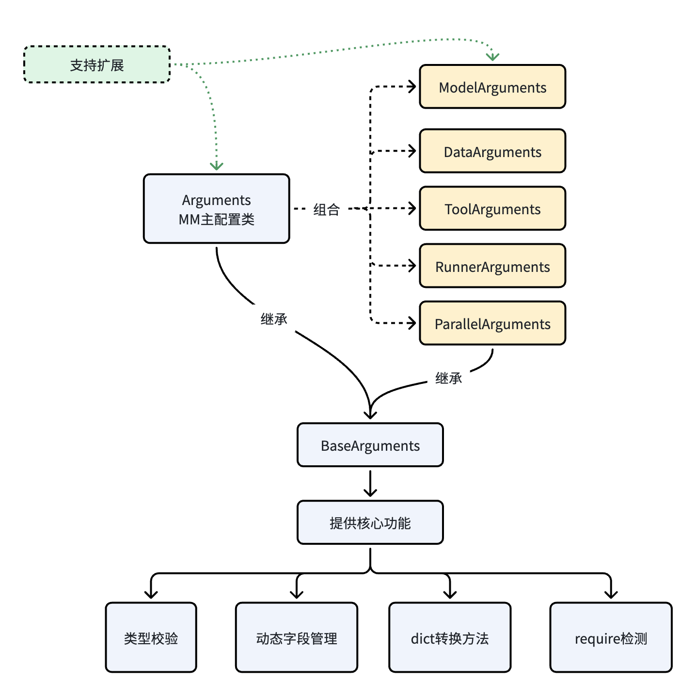
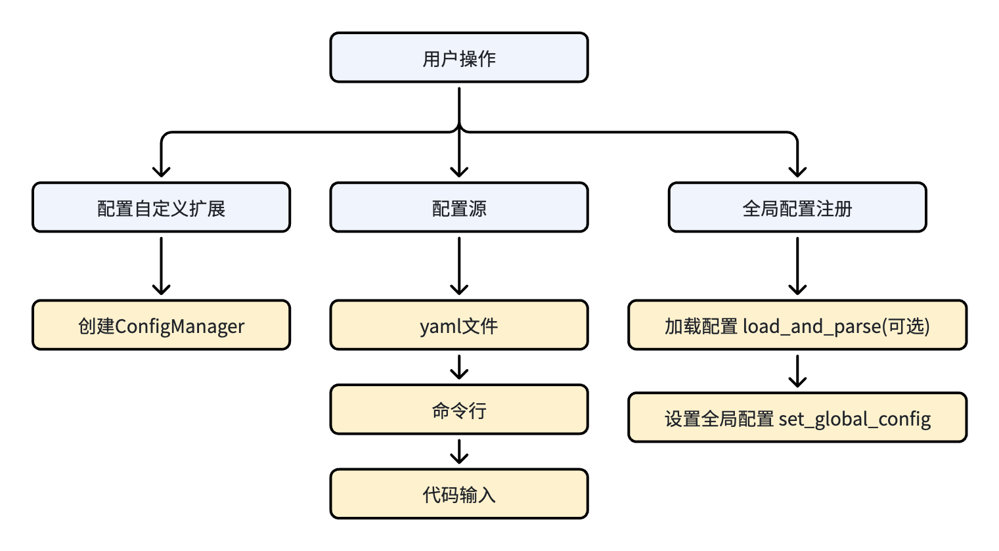

# Config中心使用手册

## 总体设计

### 设计目标

1. 独立配置模块：ConfigManager是独立模块，可与trainer、model、parallel等所有功能模块解耦
2. 多配置源支持：支持命令行参数、YAML配置文件、代码传入配置，优先级：命令行 > 代码传入 > YAML > 默认值
3. 灵活扩展：支持动态扩展配置项，支持继承BaseArguments定义结构化配置
4. 类型安全：基于BaseArguments实现强类型校验，确保配置项类型正确性

### 配置项生效规则

1. 基础校验：BaseArguments基类提供数据类型校验、动态字段注册功能
2. 强校验：TrainArguments中定义的配置项会进行强类型校验
3. 命令行限制：不允许在命令行添加TrainArguments中未定义的多级配置项
4. 参数格式：只支持key=value格式的命令行参数，不支持--xxx格式
5. 扩展方式：
   - 可继承TrainArguments添加新的BaseArguments子类
   - 可在ConfigManager中注册动态字段
   - 可在YAML中添加扩展字段（需开启自动注册）

## 核心类说明

### BaseArguments & Arguments

基于Pydantic实现的配置基类，提供类型校验和动态字段支持。

**主要功能：**

- 类级动态字段注册
- 运行时类型校验
- 嵌套配置支持
- 必填字段验证

**核心方法：**

```python
@classmethod
def register_field(cls, name: str, value_type: Optional[Type] = None,  default: Any = None, description: str = "", required: bool = False)
# 注册动态字段

def to_dict(self) -> Dict[str, Any]
# 转换为字典

def to_str(self) -> str
# 格式化为字符串
```

**使用示例：**

```python
from mindspeed_mm.config.arguments.base_args import BaseArguments
from typing import List, Optional

class ModelConfig(BaseArguments):
    """模型配置"""
    model_name: str = "gpt2"
    hidden_size: int = 768
    num_layers: int = 12
    
class MyArguments(BaseArguments):
    """自定义配置"""
    # 静态字段
    learning_rate: float = 1e-4
    batch_size: int = 32
    
    # 嵌套配置
    model_config: ModelConfig = ModelConfig()

# 注册动态字段
MyArguments.register_field(
    name="new_field",
    value_type=str,
    default="default_value",
    description="新字段描述",
    required=False
)
```

MindSpeed MM中提供了Arguments类作为配置基类，强烈建议用户在自定义扩展配置时继承此类，以保证框架中所需的配置可以被正确初始化。Arguments类构成如下：



### ConfigManager

配置管理器，负责加载和合并各种配置源。

初始化参数管理器：

```python
def __init__(self,
             config_class: Type[BaseArguments] = Arguments,
             config_file_path: Optional[str] = None,
             additional_args: Optional[Dict[str, Any]] = None,
             allow_yaml_extensions: bool = True,
             allow_cli_override: bool = True,
             strict_cli_validation: bool = True,
             allow_register_yaml_fields: bool = True)
```

**参数说明：**

- config_class: 配置类，必须是BaseArguments的子类
- config_file_path: YAML配置文件路径
- additional_args: 代码传入的额外配置
- allow_yaml_extensions: 是否允许YAML配置扩展
- allow_cli_override: 是否允许命令行覆盖配置
- strict_cli_validation: 是否严格校验命令行参数
- allow_register_yaml_fields: 是否允许自动注册YAML中的新字段

**核心方法：**

```python
def load_and_parse(self) -> BaseArguments
# 加载和解析所有配置源

def get_config(self) -> Optional[BaseArguments]
# 获取当前配置对象

def get_defined_fields(self) -> List[str]
# 获取所有定义字段（含动态字段）

def register_dynamic_field(self, name: str, value_type: Optional[Type] = None,
                          default: Any = None, description: str = "", required: bool = False)
# 注册动态字段（支持嵌套字段）

def save_config(self, file_path: str, include_dynamic: bool = True, include_yaml: bool = True)
# 保存配置到文件

def print_summary(self)
# 以结构化的方式展示配置系统的完整状态，包括静态定义字段、动态注册字段、配置来源等信息。
```

## 使用方法

基本使用方法如下图所示：



**基础使用：**

```python
from mindspeed_mm.config.config_manager import ConfigManager
from mindspeed_mm.fsdp.params.argument import Arguments

# 方式1：最简单使用（自动读取命令行和YAML）
config_manager = ConfigManager()
config = config_manager.load_and_parse()

# 方式2：指定配置文件
config_manager = ConfigManager(
    config_file_path="config.yaml",
    additional_args={"learning_rate": 1e-4}
)
config = config_manager.load_and_parse()

# 使用配置
print(config.learning_rate)
print(config.model.model_name)
```

**YAML配置文件：**

```yaml
# config.yaml
model:
  xxx

data:
  xxx

# 动态扩展字段（需开启allow_register_yaml_fields）
custom_field: "custom_value"
nested_custom:
  field1: 123
  field2: "text"
```

**命令行参数覆盖：**

```bash
# 基本格式：key=value
torchrun $DISTRIBUTED_ARGS trainer.py config.yaml learning_rate=0.001 batch_size=32

# 嵌套字段支持
torchrun $DISTRIBUTED_ARGS trainer.py config.yaml model.model_name=gpt2 data.dataset.path=/path/to/data

# 布尔值支持
torchrun $DISTRIBUTED_ARGS trainer.py config.yaml use_amp=true
```

**代码中扩展配置：**

```python
from mindspeed_mm.config.config_manager import ConfigManager
from mindspeed_mm.config.arguments.base_args import BaseArguments
from typing import List

# 定义自定义配置类
class CustomArguments(BaseArguments):
    """自定义配置"""
    custom_field: str = "default"
    custom_list: List[int] = [1, 2, 3]

# 创建ConfigManager
config_manager = ConfigManager(
    config_class=CustomArguments,
    allow_yaml_extensions=True,
    allow_register_yaml_fields=True
)

# 注册动态字段
config_manager.register_dynamic_field(
    name="dynamic_field",
    value_type=int,
    default=100,
    description="动态字段示例"
)

# 注册嵌套动态字段
config_manager.register_dynamic_field(
    name="data.custom.nested_field",
    value_type=str,
    default="nested_default",
    description="嵌套动态字段"
)

# 从代码传入配置
config_manager = ConfigManager(
    additional_args={
        "learning_rate": 2e-4,
        "model": {
            "model_name": "custom_model"
        }
    }
)
```

## MindSpeed MM主配置项构成

配置项主要包含以下几大模块：

- **parallel（并行策略）**：定义了分布式训练的核心并行能力，包括FSDP2全分片、专家并行（EP）、序列并行（CP）等。用户可在此配置分片计划、重计算策略以及各并行维度的具体参数。
- **data（数据配置）**：用于配置数据集与数据加载流程。框架内置了通用的dataloader机制，并支持通过指定dataset_type（如huggingface）来灵活接入用户自定义的数据集。此部分涵盖数据预处理、采样策略、数据加载器参数等。
- **model（模型配置）**：定义了与模型结构、加载、优化相关的参数。包括指定模型ID、HuggingFace模型路径、注意力实现方式、需要冻结的模块、损失函数配置以及是否启用特定优化（如分块损失、Triton算子等）。
- **training（训练配置）**：涵盖了训练过程的各项超参数与执行设置。例如学习率与调度策略、批量大小、优化器选择、训练步数、梯度裁剪、检查点保存/加载路径等。
- **tools（工具配置）**：提供了一系列辅助工具和性能分析选项。主要包括profile（性能剖析）和memory_profile（内存快照）等功能，用于帮助用户定位训练过程中的性能瓶颈与内存使用情况。
