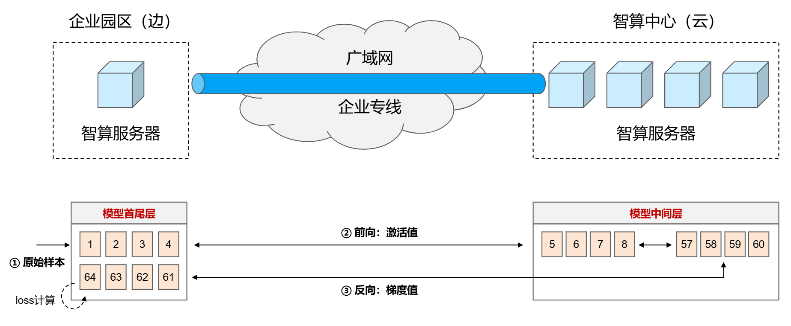
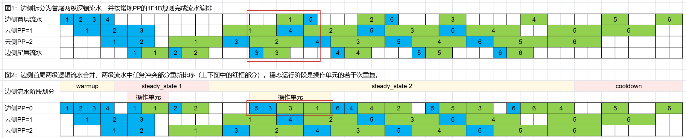

# 边云协同分布式安全训练

## 使用场景

### 特性介绍

边云协同分布式训练是为“运营商提供数据安全的算力租赁业务”而设计的特性。

目前，针对企业客户（如金融、医疗等）大模型微调的需求，有两种主流方案：

- 企业自建算力：其缺点是投资大（需要购买训练服务器、自建机房等），难以在中小企业推广；
- 租赁运营商算力：其缺点是需要上传样本至运营商云服务器，数据隐私及合规性要求难以满足。

边云协同分布式训练是一种同时满足“本地微算力”和“数据不出园”的训练方案。该方案在常规PP并行的基础上，采用了新的模型切分方案：少量直接处理原始样本的模型块部署在企业本地（边侧）、大量仅需处理中间结果的模型块部署在运营商侧（云侧）。在此部署方案下，边侧仅需少量算力处理模型首尾层，且原始样本无需上传云端。



边云协同分布式训练特性支持以下功能：

- 原始样本不上云：PP并行支持模型U-shape切分，模型首尾层同时部署在边侧，云侧无需读取样本；
- 跨域协同训练性能优化：通过流水编排优化和计算通信掩盖，实现边云跨域连接场景的高效训练。

### 方案原理

原理说明：PP并行支持模型U-shape切分，即模型首尾层参数在第一级流水线共部署。实际使用时，可以指定边侧设备为第一级流水，则模型首尾层同时部署在边侧。

训练过程中，单样本的训练流程如下：

- 前向传播（边）：边侧读取原始样本，经过模型首层处理后，转换为激活值传输至云侧；
- 前向传播（云）：云侧收到边侧的激活值后，完成中间隐藏层处理，将结果发送至边侧；
- 前向传播（边）：边侧完成模型尾层处理、并完成loss计算，前向传播阶段完成；

反向传播流程类似。

效果：整个训练流程中，边侧仅向云侧发送激活值（前向传播阶段）和梯度（反向传播阶段），原始样本无需上云。

注：U-Shape切分情况下，每个样本在边侧需要完成四步处理：模型首层前向（ForwardStart，FS）、模型尾层前向（ForwardEnd，FE）、模型尾层反向（BackwardStart，BE）和模型首层反向（BackwardEnd，BE）。

### 跨域协同训练性能优化

功能说明：针对U-shape模型切分，优化流水编排，并通过计算通信掩盖实现跨域训练高算效。

流水编排方案：U-shape模型切分情况下，相比常规PP（第一级流水处理FS、BE），第一级流水还要额外处理（FE、BS）。流水编排方案设计如下：

- 步骤1：将第一级流水拆分为两级逻辑流水（一级处理首层、一级处理尾层），并参照常规PP并行的1F1B schedule，完成流水编排；
- 步骤2：将两级逻辑流水合并，若两级流水的任务队列出现冲突，则优化任务执行顺序。

案例：PP=3，mbn = 4


其中上图为步骤1生成的两级逻辑流水、下图为步骤2合并后的最终流水方案。步骤2合并边侧两级流水时出现了任务冲突，优化阶段时按FS-FE-BS-BE的执行顺序重排。优化的依据是此执行顺序可以增大可容忍边云通信时延：以样本3的前向传播通信为例，其通信时间可以由样本5的前向计算时间掩盖，提升了可容忍通信时延，从而在拉远收敛场景下减小算效损失。

综上，边侧流水编排规则如下（云侧参照常规PP的中间层进行编排）：

| 阶段| 操作 | 次数 | 案例计算结果 |
| --- | --- | --- | --- |
| warmup | FS | PP+1 | 4 |
| steady state 1 | FEBS | floor((PP-1)*2/3 - 1/2 + 2) | 2 |
| steady state 2 | FS-FE-BS-BE | mbn - floor((PP-1)*2/3 - 1/2 + 2) | 2 |
| cooldown | BE | floor((PP-1)*2/3 - 1/2 + 2) | 2|

效果：以上流水编排方案可保证稳态运行阶段（steady state）不引入额外空泡。当边云通信时延小于 tf（边侧单个microbatch的前向计算时间）时，稳态运行阶段无额外空泡（warmup/cooldown阶段有少量额外空泡）。

## 使用方法

由于边云协同分布式训练特性当前仅支持Qwen2.5VL系列模型，因此本文档以Qwen2.5VL-32B-Instruct模型为例（PP=8，vit隐藏层数32层，llm隐藏层数64层）介绍使能方法，具体步骤如下：

1. 参考[MindSpeed MM安装指导](../install_guide.md)，完成环境安装。

2. 从Hugging Face库下载对应的模型权重[Qwen2.5-VL-32B-Instruct](https://huggingface.co/Qwen/Qwen2.5-VL-32B-Instruct)，放至./ckpt/hf_path路径下。

3. 进行权重转换，将HF权重转换成Megatron-Mcore格式。

    调用方法hf_to_mm_ldt生成U-shape切分模型权重。

    ```json
    mm-convert Qwen2_5_VLConverter hf_to_mm_ldt \
    --cfg.mm_dir "ckpt/mm_path/Qwen2.5-VL-32B-Instruct" \
    --cfg.hf_config.hf_dir "ckpt/hf_path/Qwen2.5-VL-32B-Instruct" \
    --cfg.parallel_config.llm_pp_layers [[1,9,9,9,9,9,9,8],[1,0,0,0,0,0,0,0]] \
    --cfg.parallel_config.vit_pp_layers [[32,0,0,0,0,0,0,0],[0,0,0,0,0,0,0,0]] \
    --cfg.parallel_config.tp_size 2
    ```

    各参数解析如下：

    | 参数              | 说明                                       | 必填 |
    | ----------------- | ------------------------------------------ | ---- |
    | `--cfg.mm_dir`      | Megatron权重保存路径           | 是   |
    | `--cfg.hf_config.hf_dir` | 原始HF模型权重路径                         | 是   |
    | `--cfg.parallel_config.llm_pp_layers`| LLM模块PP切分每张卡上切分几层 (required, type: list[Annotated[int, Ge(ge=0)]])            | 是   |
    | `--cfg.parallel_config.vit_pp_layers`  | VIT模块PP切分每张卡上切分几层 (required, type: list[Annotated[int, Ge(ge=0)]])          | 是   |
    | `--cfg.parallel_config.tp_size` | TP切分大小    | 是   |

    通过--cfg.parallel_config.llm_pp_layers指定各级流水线的隐藏层数，两个子列表中的首个元素表示流水线头尾上部署的llm隐藏层数，实际部署时会部署在一起。

4. 数据集下载（以COCO2017数据集为例）

    用户需要自行下载COCO2017数据集[COCO2017](https://cocodataset.org/#download)，并解压到项目目录下的./data/COCO2017文件夹中。
        
    获取图片数据集的描述文件（[LLaVA-Instruct-150K](https://huggingface.co/datasets/liuhaotian/LLaVA-Instruct-150K/tree/main)），下载至./data/路径下。

    运行数据转换脚本python examples/qwen2vl/llava_instruct_2_mllm_demo_format.py，转换后参考数据目录结构如下：

    ```bash
    $playground
    ├── data
        ├── COCO2017
            ├── train2017

        ├── llava_instruct_150k.json
        ├── mllm_format_llava_instruct_data.json
        ...
    ```

5. 启动微调训练。

    在模型配置文件examples/qwen2.5vl/model_32b.json中添加以下参数开启边云协同分布式训练特性：

    ```json
    {
        ...
        "patch": {
            "layerwise_disaggregated_training": true
        }
    }
    ```

    同时在模型配置文件examples/qwen2.5vl/model_32b.json中修改以下参数以配置非均匀PP切分。按照以下方法配置vision_encoder和text_decoder的pipeline_num_layers参数，实际部署方式为：首级流水线上部署32层vit+text_decoder头部隐藏层\*1+text_decoder尾部隐藏层\*1，其余流水线上部署text_decoder的中间隐藏层，层数为9,9,9,9,9,9,8。

    ```json
    {
        "image_encoder": {
            "vision_encoder": {
                "pipeline_num_layers": [[32, 0, 0, 0, 0, 0, 0, 0], [0, 0, 0, 0, 0, 0, 0, 0]],
                ...
            },
        },
        "text_decoder": {
            "pipeline_num_layers": [[1, 9, 9, 9, 9, 9, 9, 8], [1, 0, 0, 0, 0, 0, 0, 0]],
            ...
        },
        ...
    }
    ```

    配置模型微调脚本，详细配置请参考[Qwen2.5VL-32B微调脚本](../../../examples/qwen2.5vl/finetune_qwen2_5_vl_32b.sh)，开启边云协同特性需要在训练脚本中增加以下参数：

    ```shell
    --virtual-pipeline-model-parallel-size 2         # 虚拟Pipeline Stage数，必须配置为2
    ```

    相关参数设置完毕后，运行微调脚本：

    ```shell
    bash examples/qwen2.5vl/finetune_qwen2_5_vl_32b.sh
    ```

## 使用约束

### 模型范围

- 支持qwen2.5VL 32B模型。
- 暂不支持MoE模型。

### 其他约束

- 暂不支持LoRA
- 暂不支持常规VPP并行：`--virtual-pipeline-model-parallel-size`传参必须为`2`，使能首尾层共部署。

## 注意事项

- 训练参数的并行配置（如TP/PP）需要与权重转换时的配置保持一致。
- 边云协同分布式训练采用U-shape切分方案，模型首尾层同时部署在边侧，原始样本无需上传云端。
- 跨域协同训练通过流水编排优化和计算通信掩盖，实现边云跨域连接场景的高效训练。
